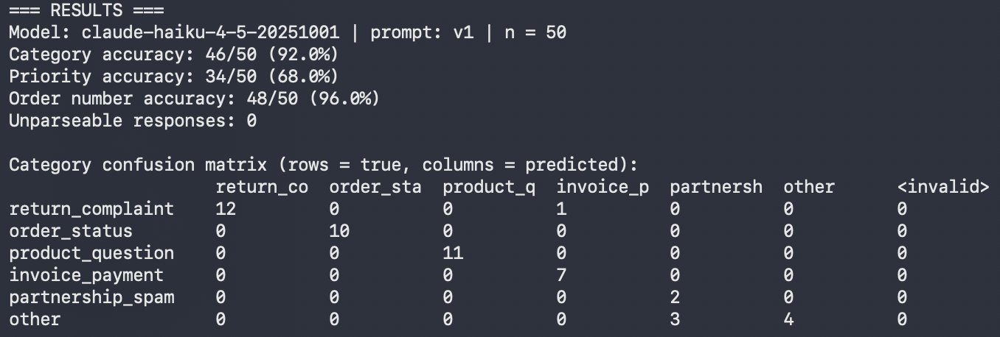

# Email Triage (Simulated Scenario)


## What it does
For each customer email the model returns a category, a priority, the order
number (if present) and a one-sentence summary. Definitions and priority
rules live in `scenario.md` and are inserted into the prompt unchanged, so
the model and the human labeller work from the same specification.

## Method
1. 50 synthetic emails generated with an LLM from a fixed plan
   (6 categories, 10 deliberately hard cases).
2. Labelled by hand, before any model output was seen.
3. Baseline v1 evaluated once; errors analysed manually (`error_analysis.md`).
4. Rules clarified (v2). Evaluated on a separate set of 30 emails, labelled
   and committed to git before the evaluation was run.

## Repository
| File | Purpose |
|---|---|
| `scenario.md` / `scenario_v1.md` | Categories, priority rules (v2 and frozen v1) |
| `dataset/` | Emails and labels (all synthetic) |
| `generate_dataset.py` | Dataset generator |
| `evaluate.py` | Classification and metrics |
| `rescore.py` | Re-scoring with documented label corrections |
| `error_analysis.md`, `label_corrections.md` | Analysis of v1 errors |
| `results/` | Raw outputs of every run |

## How to run
```bash
pip install -r requirements.txt
cp .env.example .env        # add your Anthropic API key
python3 evaluate.py
```

## Limitations
- Synthetic emails written by an LLM are cleaner than real ones.
- Small samples (50 and 30): one email is 2 and 3.3 percentage points.
- One person labelled the data; no inter-annotator agreement measured.
- Priority rules were refined after seeing v1 errors, so v2 results are only
  meaningful on the fresh set.
- Cost estimate uses assumed token prices.
- No real customer data, attachments or email threads.
- Only 2 (first set) and 1 (fresh set) emails are labelled `partnership_spam`:
  the generator produced mostly customers asking about spam, so detection of
  real spam senders is effectively untested.
- The fresh set was also inspected after evaluation, so any further prompt
  change needs another fresh set.

## Next steps
- Email trigger (n8n) instead of a CSV file.
- Escalation rule for sensitive cases (e.g. a suspected data leak).
- Test on a small set of anonymised real emails with a business partner.


LLM-based triage of customer emails for a fictional online bike shop.
**Simulated scenario with synthetic data.** See `scenario.md`.

## Status
Baseline (v1) measured on 50 hand-labelled emails. Improved rules (v2) are
being tested on a separate, fresh set of 30 emails.

## Results

### Baseline v1: 50 emails, original labels (headline result)



| Metric | Result |
|---|---|
| Category accuracy | 92% (46/50) |
| Priority accuracy | 68% (34/50) |
| Order number extraction | 96% (48/50) |
| Unparseable responses | 0 |
| Cost per 1,000 emails | about $1.02 (assumed prices, to be verified) |
| Mean latency | 1.55 s |

### Same run after 6 documented label corrections

| Metric | Result |
|---|---|
| Category accuracy | 94% (47/50) |
| Priority accuracy | 78% (39/50) |

Each correction fixes a label that contradicted a rule I had written in
`scenario.md`. All six improve the score, so I treat the original result as
the headline and list every change in `label_corrections.md`.

### v1 vs v2 rules on a fresh test set (30 emails)

| Prompt | Category | Priority | Order number |
|---|---|---|---|
| v1 (original rules) | 26/30 (86.7%) | 20/30 (66.7%) | 29/30 |
| v2 (clarified rules) | 28/30 (93.3%) | 19/30 (63.3%) | 28/30 |

Labels for this set follow the v2 rules, so v1 is disadvantaged by design.
Each prompt was run once.

**Findings**
- Category: the v2 rule on spam senders fixed 2 of 3 false `partnership_spam`
  predictions and broke none. This is 2 emails out of 30, so it is
  suggestive, not conclusive.
- Priority: no improvement (20/30 vs 19/30). 9 of 10 priority errors from v1
  also occur in v2, so the errors are systematic rather than random.
- The model over-rates priority in 9 of 11 priority errors (cautious
  direction for triage).
- Order number accuracy moved from 29/30 to 28/30 although no rule concerns
  it, which gives a rough sense of run-to-run noise.
- Cost per 1,000 emails rose from about $1.02 to $1.15 (assumed prices) because
  the v2 prompt is longer.

### Notes
- With n = 50, one email is 2 percentage points. Small differences are noise.
- Labels were assigned by one person, so annotation bias is possible.
- Error analysis: `error_analysis.md`.