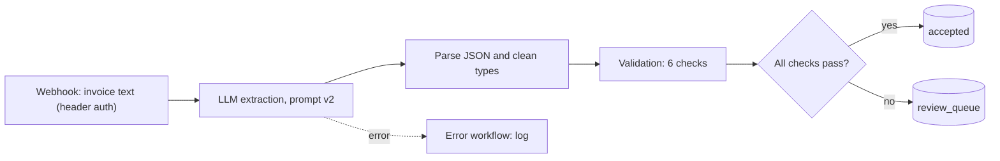

# Invoice Intake Workflow in n8n (Simulated Scenario)

> Learning project, built with the help of an AI assistant (Claude).

An n8n workflow that takes invoice text, extracts nine fields with an LLM,
validates them with deterministic checks and routes the invoice to
`accepted` or to a `review_queue`. It reuses the frozen prompt v2 and the
validation rules from
[invoice-extraction-simulation](../invoice-extraction-simulation).
**Simulated scenario with synthetic data.**

## Architecture

## Success criteria (fixed before building)
1. **Parity test:** the JavaScript validation produces the same list of
   failed checks as the Python implementation (`validators.py`) on all 60
   stored v2 predictions of the development set. Required: 60/60 identical.
2. **End-to-end run:** 20 invoices from the development set go through the
   whole workflow; route accuracy and any difference from the Python run
   are reported. This is not a model evaluation (the earlier test set was
   used up).
3. The exported workflow contains no credentials, and the production
   webhook is protected.
   The test-mode and production webhooks require a secret header.

## Status
In progress.

## Results
To be measured.