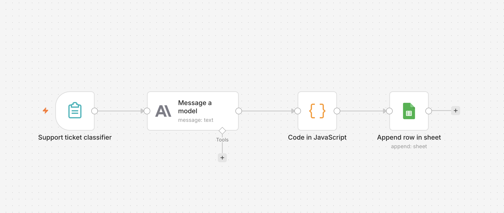
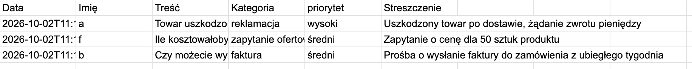

# Support Ticket Classifier

Automatic classification of incoming customer requests using an LLM.

## Problem
Small businesses receive customer messages (complaints, quotes, order
questions, invoices) in one stream. Someone has to read each message,
decide what it is and how urgent it is. This takes time and slows down
responses to urgent cases.

## Solution
An n8n workflow that:
1. Receives a request through a web form,
2. Sends it to Claude Haiku 4.5, which returns category, priority and
   a short summary as JSON,
3. Parses the response (with a fallback if the format is wrong),
4. Saves the result to a spreadsheet.

## Result
- Tested on 3 sample requests with invented data.
- Categories and priorities matched expectations in 3 of 3 cases.

## Tech stack
n8n, Anthropic API (Claude Haiku 4.5), Google Sheets, JavaScript.

## How to run
1. Import `workflow.json` into n8n.
2. Create credentials for Anthropic and Google Sheets.
3. Select your own spreadsheet in the Google Sheets node.
4. Activate the workflow and open the form URL.

## Limitations and next steps
- Categories are fixed in the prompt and should be tailored to a client.
- No support for attachments or multiple languages yet.
- Next: email trigger instead of a form, notification for high-priority cases.